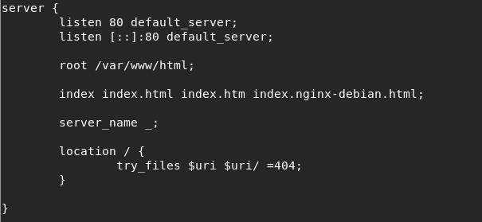
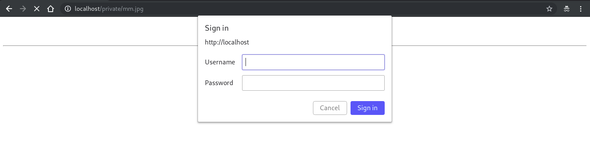

# Nginx Authentication
In this aticles, we will config a http server with nginx with url /private need login to access.
I use debian 9.

First at all, install nginx
`apt-get install nginx -y`

Nginx config file storage at /etc/nginx/nginx.conf, app config storage at /etc/nginx/sites-available and link to /etc/nginx/sites-enable.
This is default config file (/etc/nginx/sites-avaiable/default)



Additionaly, we need to create user/pass file: username is meomeo and password is meoconxinhxinh
```shell
echo -e "meomeo:`openssl passwd -apr1 meoconxinhxan`" >> /etc/nginx/.htpasswd
```
Password was saved in hash digest


Add private path to nginx config with bacsic authentication


Access to private page



Login and view something


